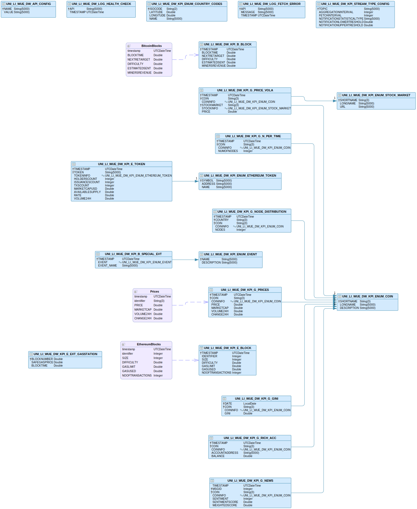

# Project Seminar: Data Analytics on Blockchain

## Projekt an der Uni Würzburg vom Team der Uni Liechtenstein

Jeder ab dem Focus Day geschriebene Code sollten immer zu diesem GitHub Repository gepushed werden. Es wird kein Branching-/Deployment Konzept genutzt, sondern jeglicher Code wird zu Beginn in den *master* branch deployed, so lange bis es eine stabile Version gibt (dies ist inzwischen der Fall). Danach wird nur noch zu dev committed.

Kritische Architekturentscheidungen werden als ADR (Architecture Decision Record), wie https://github.blog/2020-08-13-why-write-adrs/ beschrieben, dokumentiert unter docs/adr. Dabei wird https://adr.github.io/madr/ als Framework verwendet.

### Programming Guidelines

Coding Guidelines sind in jedem Modul in diesem Repo eigenständig notiert und dokumentiert. Aus Gründen der Commit-History, sollte jeder Commit eine eindeutige Message haben und jeder selbst sollte commiten.

Neuste Änderungen sollten nur im dev-Branch erfolgen. Nach erfolgreichem Versionabschluss wird ein Pull-Request von dev auf den master eröffnet und nach Approval gemerged.

## Architektur

### Gesamt

### Data Fetcher

### DW Schema

## Repo-Struktur

- data-fetcher: alle Data-Fetchers inklusive Hilfsklassen
- dw-kafka-processor: Modul, um Kafka auszulesen und ins Data Warehouse zu schreiben
- dw-sac-middleware: Modul, um mit der SAP Analytics Cloud zu kommunizieren
- dw-aggregation-job: Modul, ob historische Daten im Data Warehouse zu aggregieren
