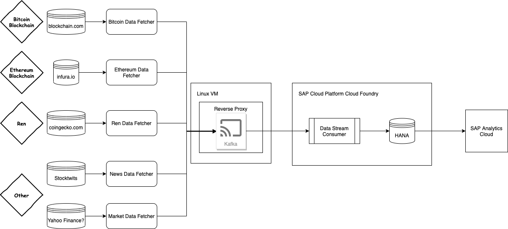
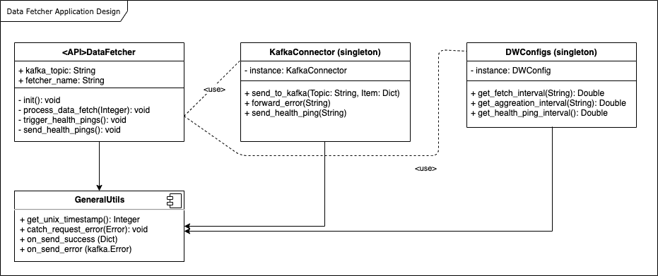

# Project Seminar: Data Analytics on Blockchain

## Projekt an der Uni Würzburg vom Team der Uni Liechtenstein

Jeder ab dem Focus Day geschriebene Code sollten immer zu diesem GitHub Repository gepushed werden. Es wird kein Branching-/Deployment Konzept genutzt, sondern jeglicher Code wird zu Beginn in den *master* branch deployed, so lange bis es eine stabile Version gibt.

### Code Guidelines

Jeder Data Fetcher hat sich vom Schema her an das Data Fetcher Skelet (RawFetcherSkeleton.py) zu halten. Ebenso sollten Variablen klar definiert werden (inklusive Bedeutung in snake_case). Der Code sollte ausführlich dokumentiert werden, wobei triviale Kommenatare gespart werden sollten. Aus Gründen der Commit-History, sollte jeder Commit eine eindeutige Message haben und jeder selbst sollte commiten.

Prinzip vor einem Commit:

- git pull
- git commit -a -m "message"
- git push

## Architektur

### Gesamt

### Data Fetcher

## Repo-Struktur

- data-fetcher: alle Data-Fetchers inklusive Hilfsklassen
- dw-kafka-processor: Modul, um Kafka auszulesen und ins Data Warehouse zu schreiben
- dw-sac-middleware: Modul, um mit der SAP Analytics Cloud zu kommunizieren