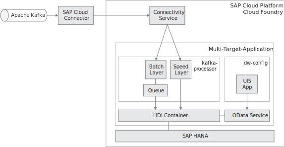

# Kafka Prozessor

Ziel des Kafka Prozessor ist es Daten aus Kafka zu konsumieren und dann via eines Streams in das Data Warehouse zu schreiben.
Dabei gibt es sowohl einen Slow Layer als auch einen Batch Layer. Wichtig ist die Verbindung zum Connectivity Service, mit welchem dann eine SOCKS5 Verbindung aufgebaut wird, welche wiederrum als Proxy für den Kafkazugriff dient.

Die csn.json Datei ist eine Metadatei resultierend aus dem srv-Modul. Dieses muss jederzeit upgedatet werden, bei jedem Rebuild vom Service.

## Deployment

cf push

## Coding Style

* Orientierung: funktional
* Style guide: nur Prettier -> .prettierrc
* Kommentierierung erfolgt funktionsweise und nach Bedarf
* Keine JavaDoc-ähnliche Kommentierung notwendig
